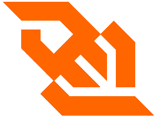

# Websocket .NET client [](https://travis-ci.org/Marfusios/websocket-client) [](https://badge.fury.io/nu/Websocket.Client)

This is a wrapper over native C# class `ClientWebSocket` with built-in reconnection and error handling. 

[Releases and breaking changes](https://github.com/Marfusios/websocket-client/releases)

### License: 
    MIT

### Features

* installation via NuGet ([Websocket.Client](https://www.nuget.org/packages/Websocket.Client))
* targeting .NET Standard 2.0 (.NET Core, Linux/MacOS compatible)
* reactive extensions ([Rx.NET](https://github.com/Reactive-Extensions/Rx.NET))
* integrated logging abstraction ([LibLog](https://github.com/damianh/LibLog))

### Usage

```csharp
var exitEvent = new ManualResetEvent(false);
var url = new Uri("wss://xxx");

using (var client = new WebsocketClient(url))
{
    client.ReconnectTimeoutMs = (int)TimeSpan.FromSeconds(30).TotalMilliseconds;
    client.ReconnectionHappened.Subscribe(type =>
        Log.Information($"Reconnection happened, type: {type}"));

    client.MessageReceived.Subscribe(msg => Log.Information($"Message received: {msg}"));
    client.Start();

    Task.Run(() => client.Send("{ message }"));

    ExitEvent.WaitOne();
}
```

More usage examples:
* integration tests ([link](test_integration/Websocket.Client.Tests.Integration))

* console sample ([link](test_integration/Websocket.Client.Sample/Program.cs))


**Pull Requests are welcome!**

### Reconnecting

There is a built-in reconnection which invokes after 1 minute (default) of not receiving any messages from the server. It is possible to configure that timeout via `client.ReconnectTimeoutMs`. Also, there is a stream `ReconnectionHappened` which sends information about a type of reconnection. However, if you are subscribed to low rate channels, it is very likely that you will encounter that timeout - higher the timeout to a few minutes or call `PingRequest` by your own every few seconds. 

In the case of remote server outage, there is a built-in functionality which slows down reconnection requests (could be configured via `client.ErrorReconnectTimeoutMs`, the default is 1 minute).

Beware that you **need to resubscribe to channels** after reconnection happens. You should subscribe to `ReconnectionHappened` stream and send subscriptions requests. 


### Multi-threading

Observables from Reactive Extensions are single threaded by default. It means that your code inside subscriptions is called synchronously and as soon as the message comes from websocket API. It brings a great advantage of not to worry about synchronization, but if your code takes a longer time to execute it will block the receiving method, buffer the messages and may end up losing messages. For that reason consider to handle messages on the other thread and unblock receiving thread as soon as possible. I've prepared a few examples for you: 

#### Default behavior

Every subscription code is called on a main websocket thread. Every subscription is synchronized together. No parallel execution. It will block the receiving thread. 

```csharp
client
    .MessageReceived
    .Where(msg => msg.StartsWith("{"))
    .Subscribe(obj => { code1 });

client
    .MessageReceived
    .Where(msg => msg.StartsWith("["))
    .Subscribe(arr => { code2 });

// 'code1' and 'code2' are called in a correct order, according to websocket flow
// ----- code1 ----- code1 ----- ----- code1
// ----- ----- code2 ----- code2 code2 -----
```

#### Parallel subscriptions 

Every single subscription code is called on a separate thread. Every single subscription is synchronized, but different subscriptions are called in parallel. 

```csharp
client
    .MessageReceived
    .Where(msg => msg.StartsWith("{"))
    .ObserveOn(TaskPoolScheduler.Default)
    .Subscribe(obj => { code1 });

client
    .MessageReceived
    .Where(msg => msg.StartsWith("["))
    .ObserveOn(TaskPoolScheduler.Default)
    .Subscribe(arr => { code2 });

// 'code1' and 'code2' are called in parallel, do not follow websocket flow
// ----- code1 ----- code1 ----- code1 -----
// ----- code2 code2 ----- code2 code2 code2
```

 #### Parallel subscriptions with synchronization

In case you want to run your subscription code on the separate thread but still want to follow websocket flow through every subscription, use synchronization with gates: 

```csharp
private static readonly object GATE1 = new object();
client
    .MessageReceived
    .Where(msg => msg.StartsWith("{"))
    .ObserveOn(TaskPoolScheduler.Default)
    .Synchronize(GATE1)
    .Subscribe(obj => { code1 });

client
    .MessageReceived
    .Where(msg => msg.StartsWith("["))
    .ObserveOn(TaskPoolScheduler.Default)
    .Synchronize(GATE1)
    .Subscribe(arr => { code2 });

// 'code1' and 'code2' are called concurrently and follow websocket flow
// ----- code1 ----- code1 ----- ----- code1
// ----- ----- code2 ----- code2 code2 ----
```


### Available for help
I do consulting, please don't hesitate to contact me if you have a custom solution you would like me to implement ([web](http://mkotas.cz/), 
<m@mkotas.cz>)

Donations gratefully accepted.
* [](https://en.cryptobadges.io/donate/1HfxKZhvm68qK3gE8bJAdDBWkcZ2AFs9pw)
* [](https://en.cryptobadges.io/donate/LftdENE8DTbLpV6RZLKLdzYzVU82E6dz4W)
* [](https://en.cryptobadges.io/donate/0xb9637c56b307f24372cdcebd208c0679d4e48a47)
